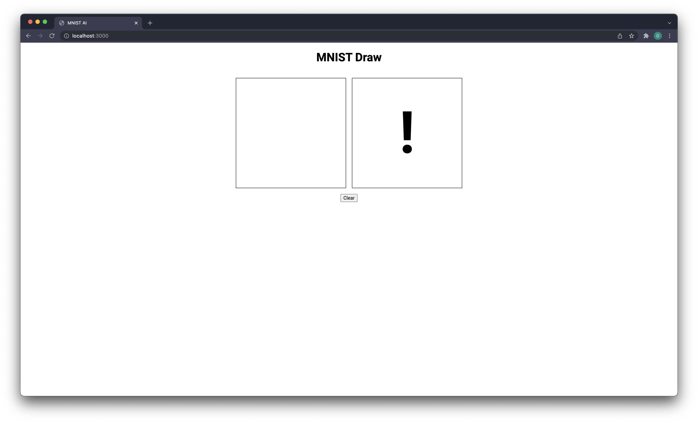
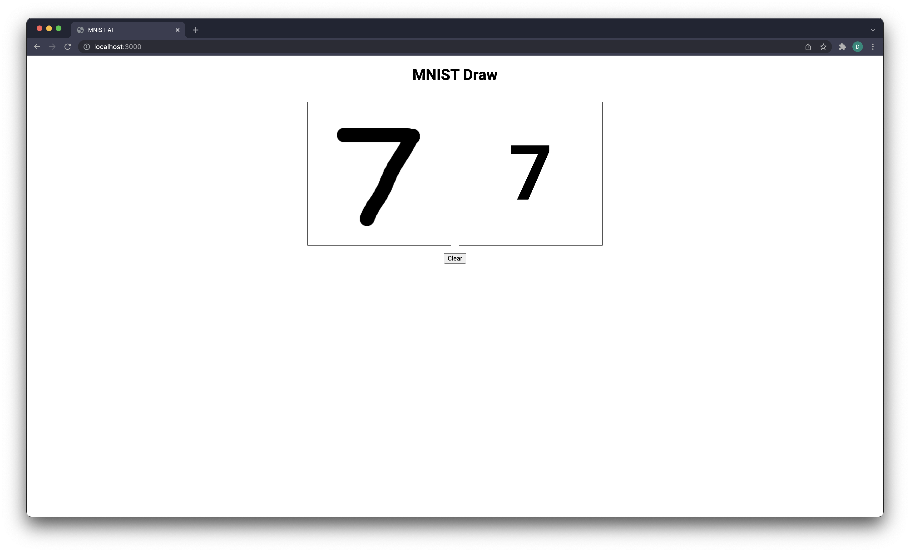
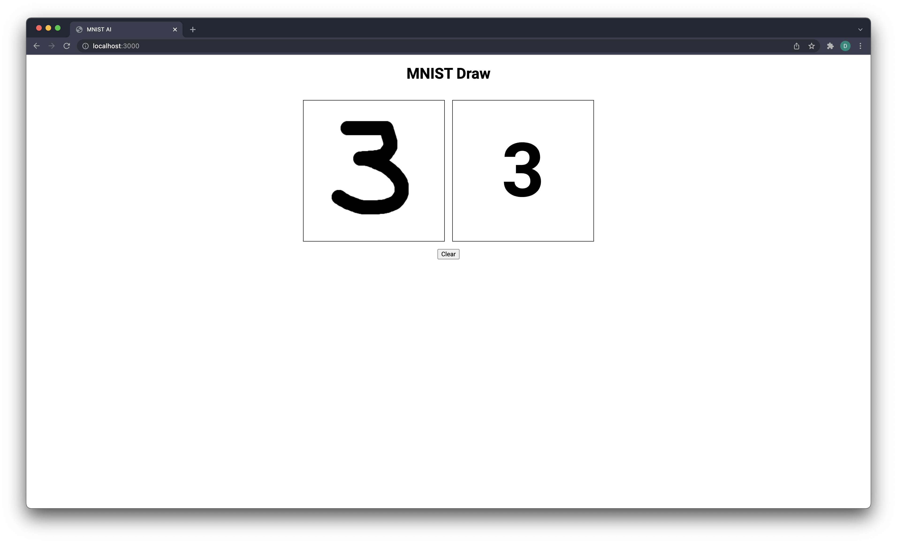
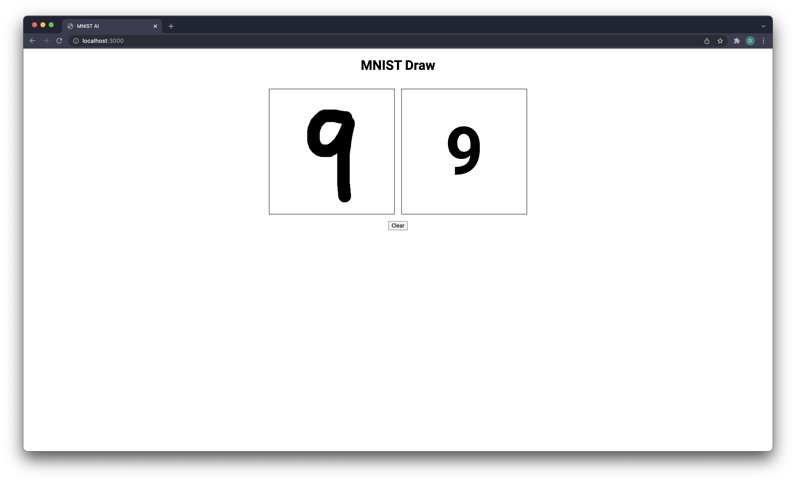

# MNet Dash

An MNIST feedforward model coded in python and served via Flask.


Run the script without flags to serve the demo application via Flask

```
usage: MNet.py [-h] [-t] [-lr LEARNING_RATE] [-e EPOCHS] [-b BATCH] [-m MODEL]

optional arguments:
  -h, --help            show this help message and exit
  -t, --train           Train model
  -lr LEARNING_RATE, --learning-rate LEARNING_RATE
                        Train learning rate
  -e EPOCHS, --epochs EPOCHS
                        Number of epochs to train
  -b BATCH, --batch BATCH
                        Batch size
  -m MODEL, --model MODEL
                        Model number
```

## Screenshots







